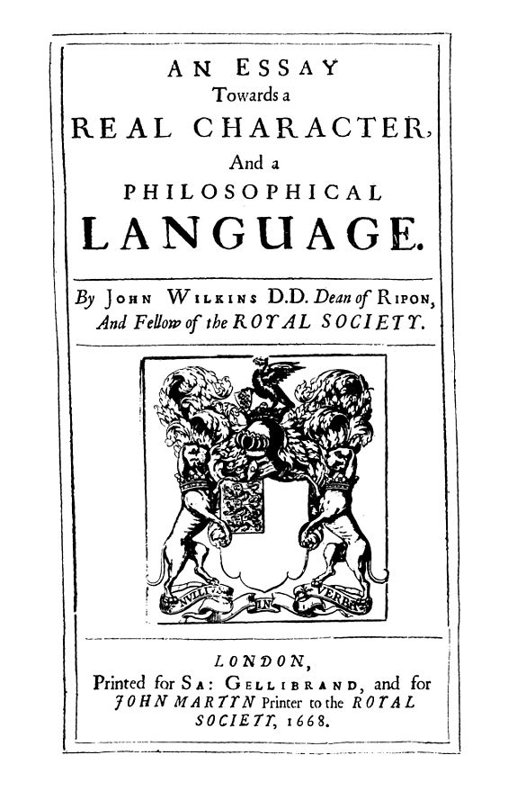

[This book happened because Borges made Foucault laugh out loud](https://www.thendobetter.com/arts/2019/7/27/messy-borges-celestial-emporium-of-benevolent-knowledge)

 
Public domain, retrieved from https://commons.wikimedia.org/wiki/File:Wilkins_An_Essay_towards_a_real.jpg
*TODO* revisit this image and colour it in :P

In order to mock a philosopher’s proposal for a “universal language,”
the author [Borges described an imaginary archaic encyclopedia, supposedly Chinese in origin](https://en.wikipedia.org/wiki/Celestial_Emporium_of_Benevolent_Knowledge) which highlights the arbitrary nature of taxonomy itself.

And again, this made Foucault laugh, and then think, and then write a 400 page book.

[Magnificent brief artist’s blog post addressing this particular passage of Foucault](http://www.paullowry.com/paullowry/TEXT/textemporium.html)

*TODO* create Pepperidge Farm remembers meme, but with “when more people had time to read and write 400 page books because there wasn’t a computer in their pocket”
