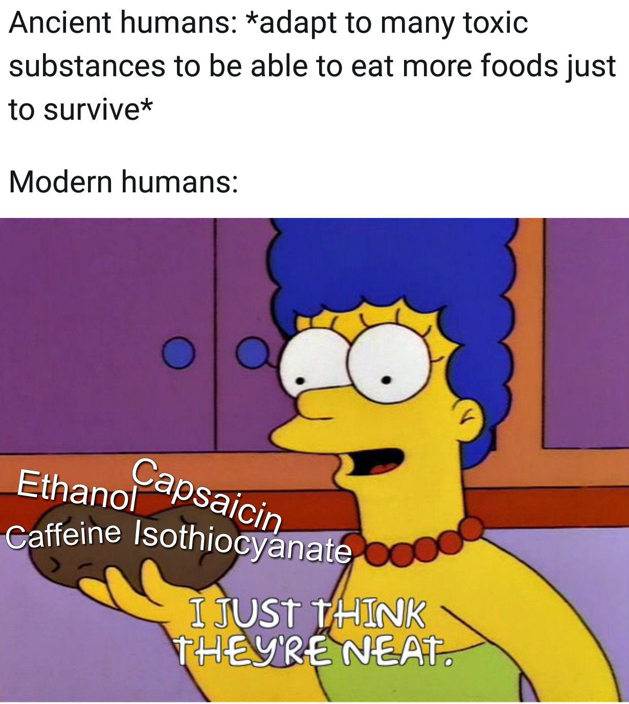
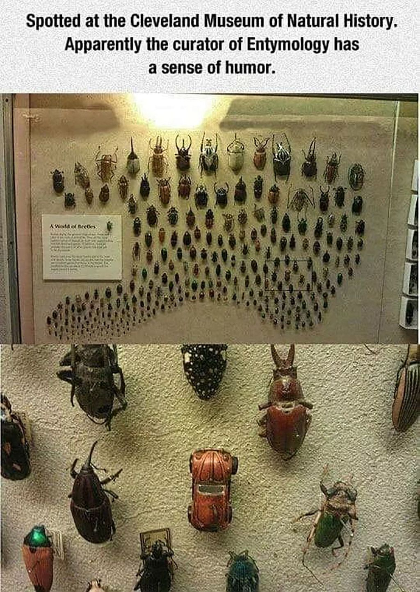

The description of natural things based upon their visible elements, and the attempt to establish a sense of ordered classes of “character” from those jumbled and diverse characteristics- 
*TODO*  link this part to Ranganathan’s faceted classification

“Structure is that designation of the visible which, by means of a kind of pre-linguistic sifting, enables it to be transcribed into language [...] not only must it designate all natural entities very precisely, but it must also situation them within the system of identities and differences that unitees them to and distinguishes them from all the others. Natural history must provide, simultaneously, a certain designation and a controlled derivation.” (Foucault, 1970, p. 138)
*TODO* summarize this complex thought in my own words

[Linnaeus](https://en.wikipedia.org/wiki/Systema_Naturae) introduced a system which was arbitrary and relative, but became the skeleton to an increasingly universalized and extensible framework for categorizing known life forms 

[Lamarck](http://knarf.english.upenn.edu/People/lamarck.html#:~:text=Lamarck%2C%20studying%20Linnaeus's%20system,largely%20the%20work%20of%20Lamarck) took this further and provided the transition point where Darwin would pivot into full modernist disruption

*TODO* go back later to deep dive on “Continuity and Catastrophe” (Foucault, 1970, pp. 145-150), to better grasp and translate the point Foucault’s making about disruption/discontinuity within natural history, in order to better draw comparison with Kuhn in “Classifying the Ages” section

## Meme Options

