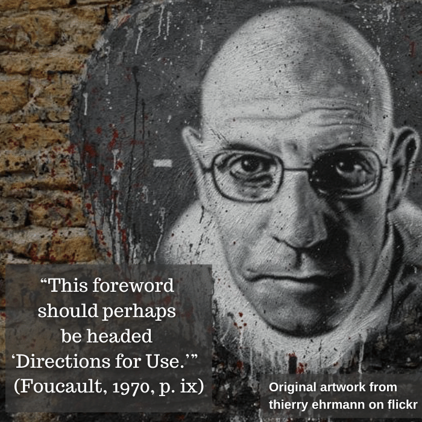
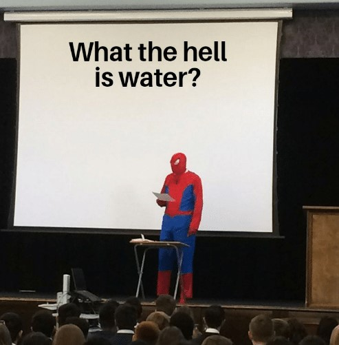
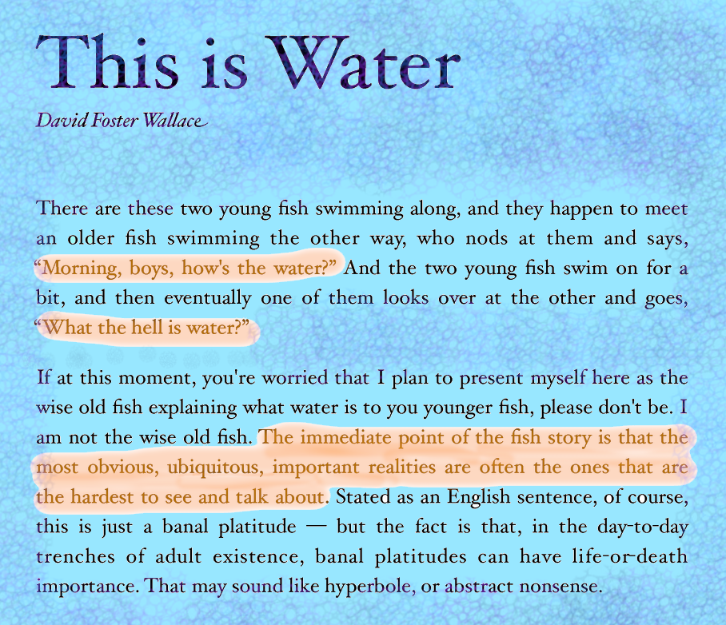

# "Directions For Use"

| Words | Pictures |
|:---------------------------------|:------------------------------------------------------|
| Foucault explains the ambitious project of this text:     to produce a cross-section of different disciplines     which **massively shifted** at certain periods of time. |    *Original art sourced from* [thierry ehrmann on flickr](https://www.flickr.com/photos/home_of_chaos/2550922632), [CC BY 2.0](https://creativecommons.org/licenses/by/2.0/) |
| With this **archaeology**     he wasn't trying to     *trace backwards*     *from the present*   to find longitudinal causation.     Instead, he was interested in     zooming in on history's timeline     from a bird's eye view     to identify apparent **disruptions**     in **power** and **knowledge**     at the **level of events**. |  |
| Foucault claims his goal     “is to reveal a [*positive*](https://en.wikipedia.org/wiki/Symptom#Positive_and_negative)     [**unconscious**](https://www.lacanonline.com/2017/04/whats-so-unconscious-about-the-unconscious/) of knowledge.” (Foucault, 1970, p. xi)     In other words,     *What’s omnipresent in science*,     [*but no scientists can see?*](https://fs.blog/2012/04/david-foster-wallace-this-is-water) |  |

[The beginning of David Foster Wallace's 2005 commencement speech at Kenyon University](https://fs.blog/2012/04/david-foster-wallace-this-is-water/)