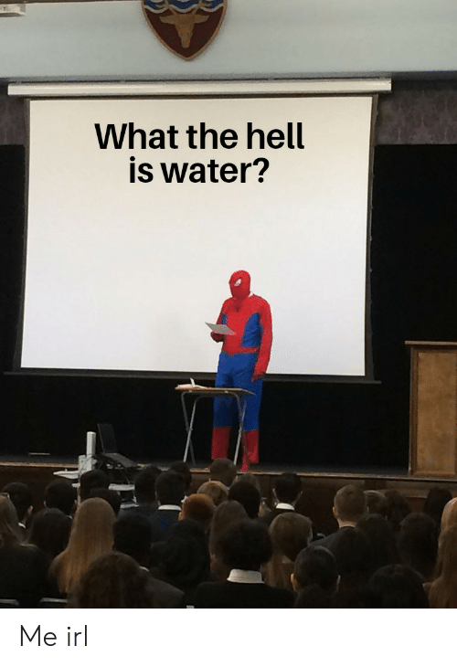

# Foreword

| Words | Pictures |
|:---------------------------------|:------------------------------------------------------|
| Foucault explains the ambitious project of this text:   to produce a cross-section of different disciplines   which massively shifted at certain periods of time. |    *Original art sourced from* [thierry ehrmann on flickr](https://www.flickr.com/photos/home_of_chaos/2550922632), [CC BY 2.0](https://creativecommons.org/licenses/by/2.0/) |
| With this **archaeology** he wasn't trying to   trace backwards from the present to find longitudinal causation.   Instead, he was interested in zooming in on history's timeline from a bird's eye view   to identify apparent **disruptions in power and knowledge at the event level**. |  |
| Foucault claims his goal “is to reveal a [*positive*](https://en.wikipedia.org/wiki/Symptom#Positive_and_negative)   [**unconscious**](https://www.lacanonline.com/2017/04/whats-so-unconscious-about-the-unconscious/) of knowledge” (Foucault, 1970, p. xi) In other words, [What’s omnipresent in science, but no scientists can see?](https://fs.blog/2012/04/david-foster-wallace-this-is-water) |  |

[The beginning of David Foster Wallace's 2005 commencement speech at Kenyon University](https://fs.blog/2012/04/david-foster-wallace-this-is-water/)