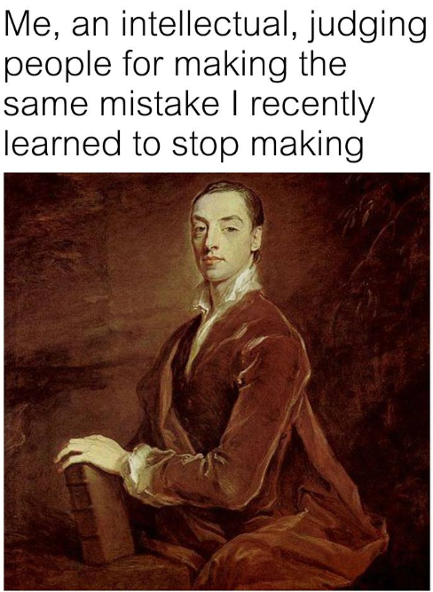
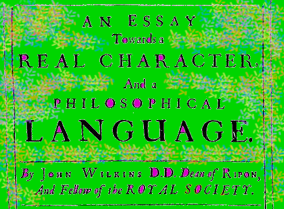

# Preface

| Words | Pictures |
|:---------------------------------|:------------------------------------------------------|
| This book happened because     [**Borges made Foucault laugh out loud**](https://www.thendobetter.com/arts/2019/7/27/messy-borges-celestial-emporium-of-benevolent-knowledge) |  |
| In order to mock     a philosopher named Wilkins'     proposal for a “universal language,”     [Borges described an imaginary archaic encyclopedia](https://en.wikipedia.org/wiki/Celestial_Emporium_of_Benevolent_Knowledge)     highlighting the arbitrary nature of taxonomy itself.     And again, this made Foucault **laugh**,     and then **think**, and then **write a 400 page book**. |      Public domain image of the book Borges was mocking,   retrieved from [Wikimedia Commons](https://commons.wikimedia.org/wiki/File:Wilkins_An_Essay_towards_a_real.jpg) |
| [Magnificent brief artist’s blog post addressing this particular passage of Foucault](http://www.paullowry.com/paullowry/TEXT/textemporium.html) |  |
