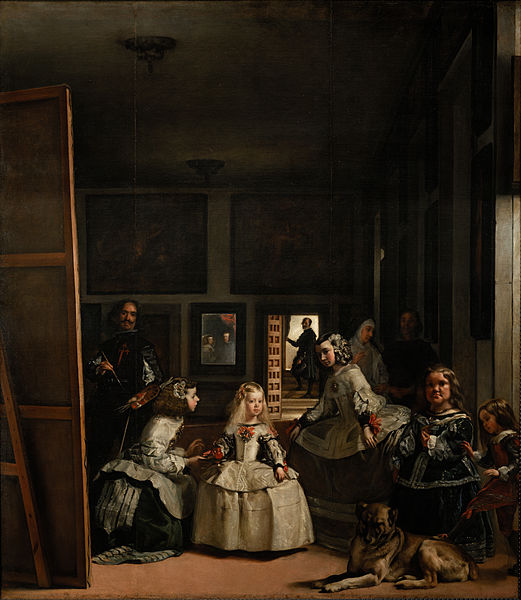
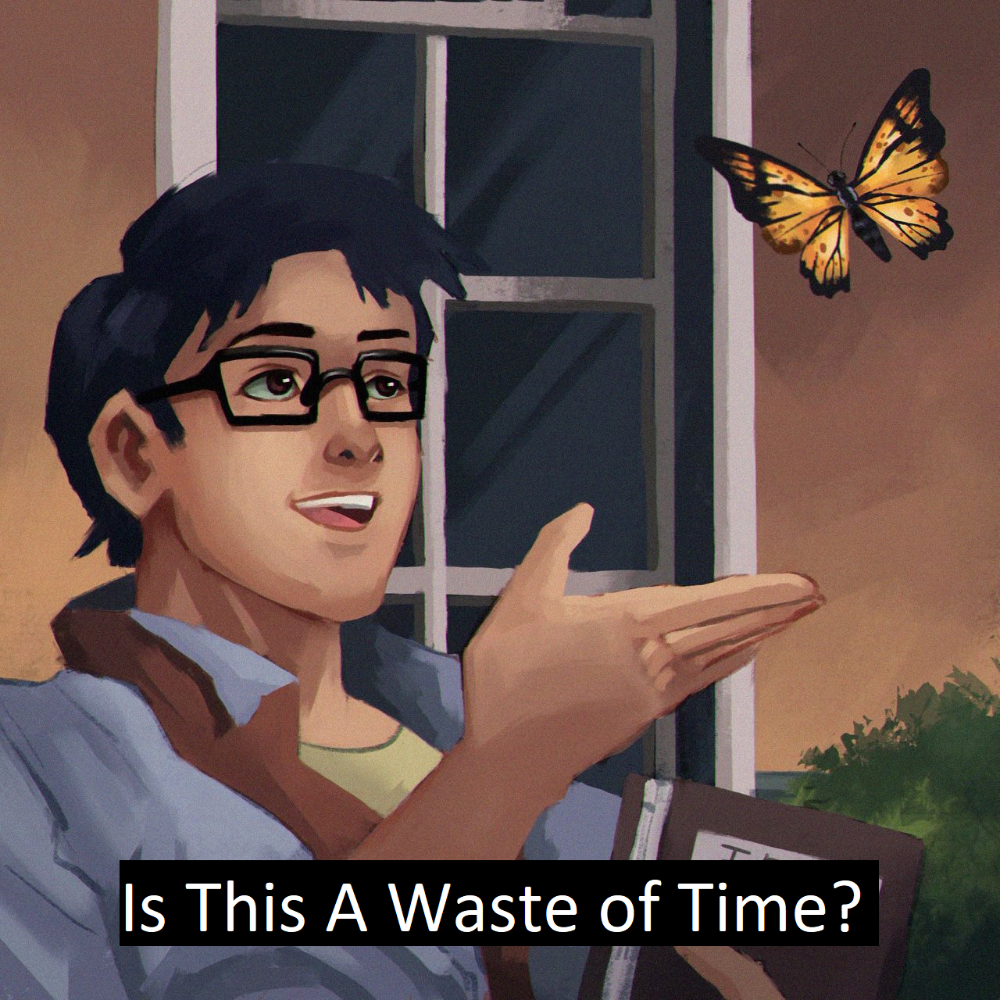
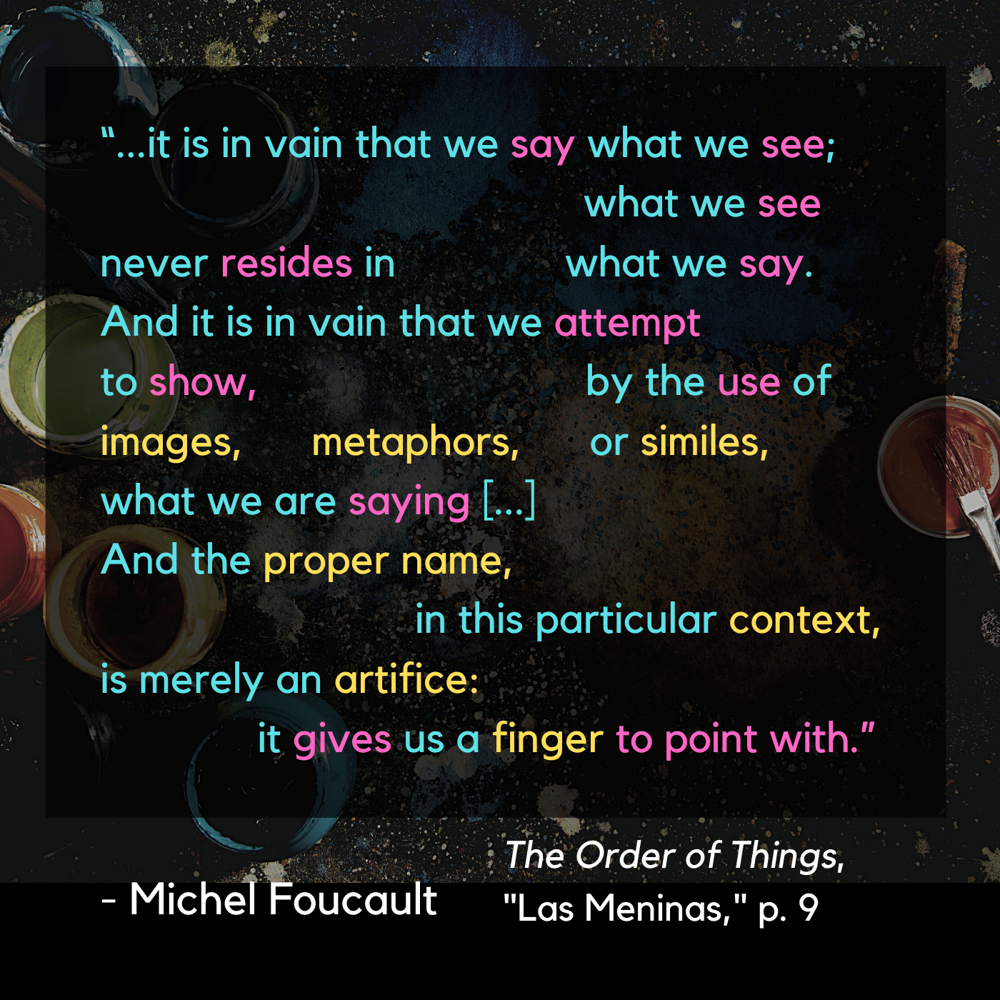

# Las Meninas

| Words | Pictures |
|:---------------------------------|:------------------------------------------------------|
| In which Foucault describes a painting...     **for more than ten pages straight!**     We traverse the subjects of this painting     in order to broach the matter     of “subject-ness” overall-     **this is Foucault’s real project**     **in The Order of Things**.     How have we come to see ourselves     as *subjects*     in ways we may not have     in earlier history? |  [The painting - Las Meninas by Diego Velázquez](https://en.wikipedia.org/wiki/Las_Meninas)   *Scroll to the bottom of the page for a closer look* |
| The way Velázquez has framed this scene, we the viewers     stand in the position of     the unseen subject being painted. Only in the distant mirror do we catch a glimpse-     oh wait, we’re the Sovereigns themselves!     **Or are we?** |  |
| The mirror’s at a strange angle;     the more you zoom in on details,     all the perspective is     slightly warped, resulting in     “an oscillation between      the interior and the exterior”,     like a quantum see-saw of subjectivity   (Foucault, 1970, p. 11).      To Foucault, this painting illuminates     the unique space of representation     in the episteme of the Classical Age:      most of all, the viewers'     blissful invisibility to themselves. | |

