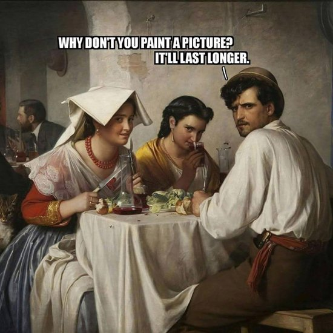

# Las Meninas

| Words | Pictures |
|:---------------------------------|:------------------------------------------------------|
| In which Foucault describes a painting...     **for more than ten pages straight!**     We traverse the subjects of this painting   in order to broach the matter   of “subject-ness” overall-   **this is Foucault’s real project**   **in The Order of Things**.     How have we come to see ourselves   as *subjects*   in ways we may not have   in earlier history? |  [The painting - Las Meninas by Diego Velázquez](https://en.wikipedia.org/wiki/Las_Meninas)   *Scroll to the bottom of the page   for a closer look* |
| The way Velázquez has framed this scene, we the viewers   stand in the position of   the unseen subject being painted.     Only in the distant mirror   do we catch a glimpse-   oh wait, we’re the Sovereigns themselves!     **Or are we?** |  |
| The mirror’s at a strange angle;   the more you zoom in on details,   all the perspective is    slightly warped, resulting in   “an oscillation between   the interior and the exterior”,   like a quantum see-saw of subjectivity   (Foucault, 1970, p. 11).      To Foucault, this painting illuminates   the unique space of representation   in the episteme of the Classical Age:    most of all, the viewers'   blissful invisibility to themselves. |  |

