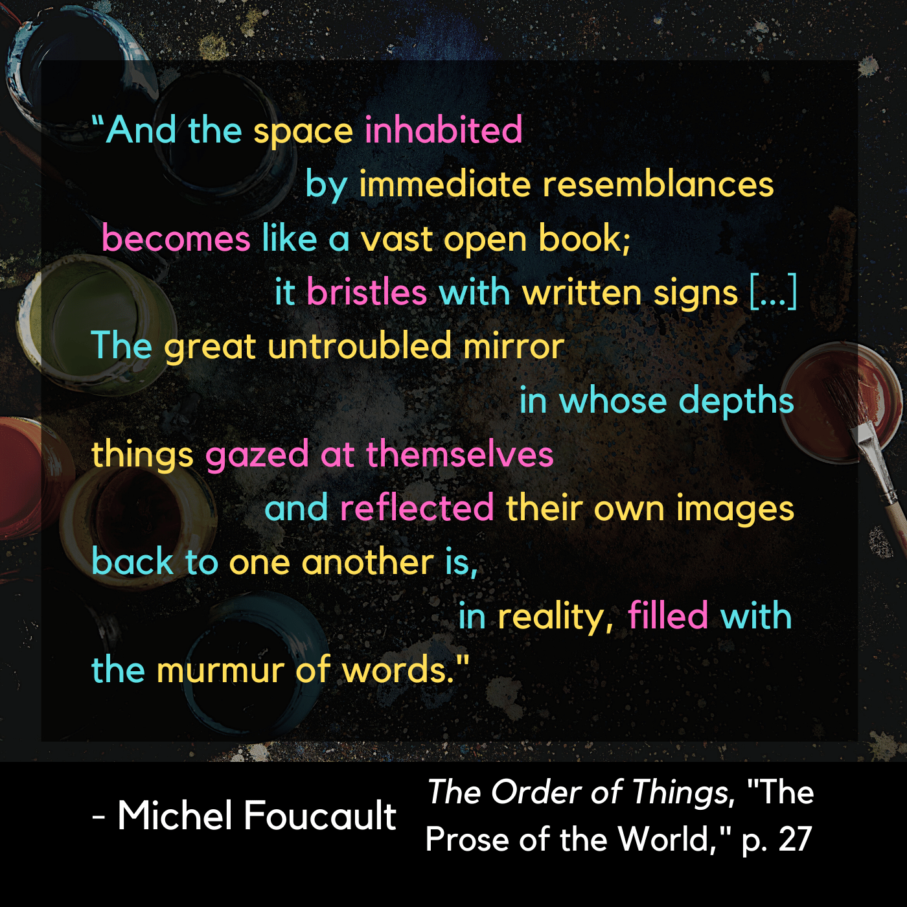

# The Prose of the World

|:---------------------------------|:------------------------------------------------------|
| Now that Foucault’s chattered about laughter, and described a painting at length, he’s comfortable getting down to brass taxes. | He wants to bring us deep into historical inquiry, and finally starts to broach some specific theses. |
| Representation throughout the Renaissance period was all about similitude- meaning every navigation of knowledge was a fresh evaluation of seemingly opaque signs. |  |

| Foucault gives the example of how literal magic was conceptually anchored right alongside education, or what the English translation of "The Order of Things" repeatedly deems [“erudition”](https://en.wikipedia.org/wiki/Erudition). | In the heritage of antiquity, [*divinatio*](https://en.wiktionary.org/wiki/divinatio) ("making nature speak") and [*eruditio*](https://en.wiktionary.org/wiki/eruditio) (“restoring sleeping language to life”) were just two sides of the same coin... |

