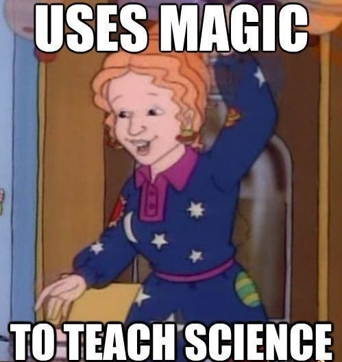

# The Prose of the World

| Words | Pictures |
|:---------------------------------|:------------------------------------------------------|
| Now that Foucault’s   chattered about laughter,   and described a painting at length,   he finally starts   to broach some specific theses.|   |
| Representation throughout   the Renaissance period   was all about similitude-      meaning every navigation   of knowledge was   a fresh evaluation   of seemingly opaque signs. |  |
| Foucault gives the example of   how *literal magic*   was conceptually anchored   right alongside education,     or what "The Order of Things"   repeatedly deems [“erudition”](https://en.wikipedia.org/wiki/Erudition).     In the heritage of antiquity,     [*divinatio*](https://en.wiktionary.org/wiki/divinatio) ("making nature speak")     and [*eruditio*](https://en.wiktionary.org/wiki/eruditio)   (“restoring sleeping language to life”)     were just two sides of the same coin... |  |

