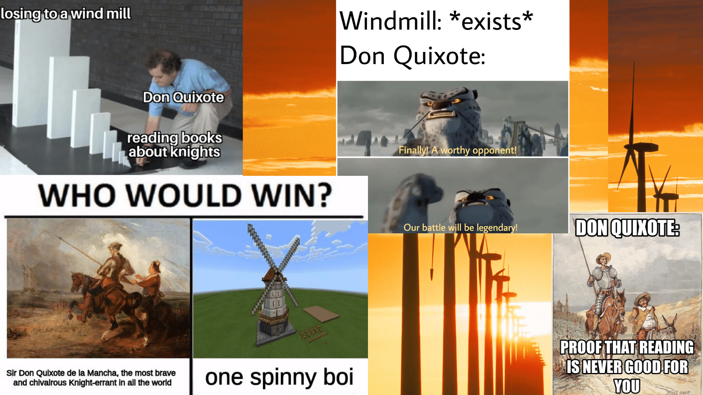

“Because the mind analyses, the sign appears. Because the mind [has signs at its disposal](https://en.wikipedia.org/wiki/Signified_and_signifier), analysis never ceases” (Foucault, 1970, p. 61)

'Sense-making' gains a longitudinal and more systemic dimension leading onward from the Classical age- instead of always “drawing things together” from face value, we begin to “discriminate” based upon rudimentary frameworks of order- *pure analogy* gives way to *gradual analysis* (Foucault, 1970, p. 55)

“In its perfect state, the system of signs is that simple, absolutely transparent language which is capable of naming what is elementary; it is also that complex of operations which defines all possible conjunctions” (Foucault, 1970, p. 62) - in other words, representation and interpretation moves beyond a flat field of signs, and starts to incorporate rulesets and action.

We can think of this 'next level' of languaged communication, in which it becomes formalized and requires a more participatory social layer, to parallel software code- it is both a set of instructions, and the means by which to execute those instructions. **Tilting at windmills!**  *this idea will become crucial when turning our focus to the new age of self-referential meaning in meme culture*

