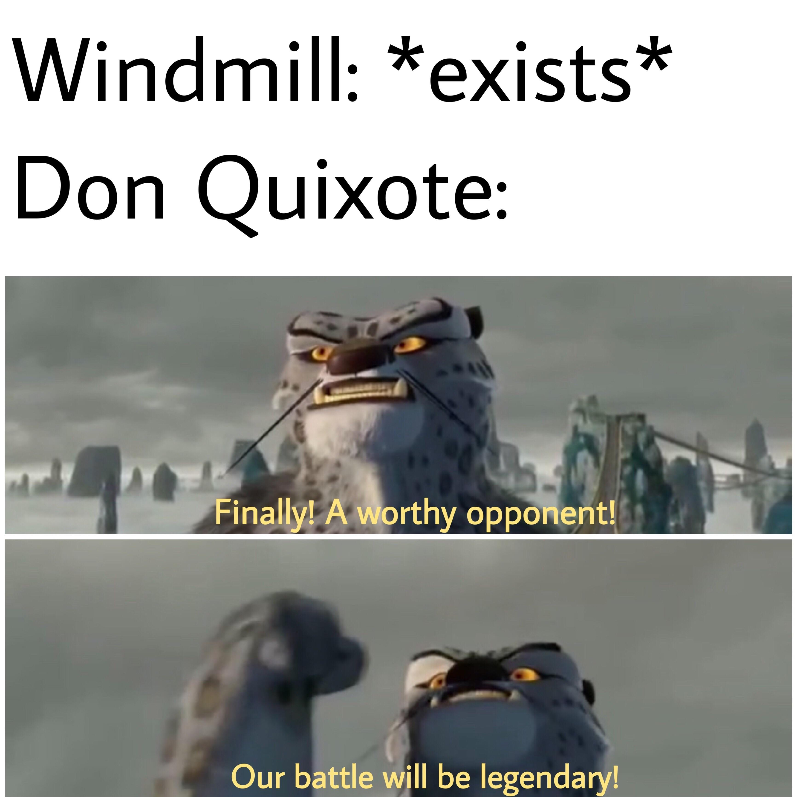

# Representing

| Words | Pictures |
|:---------------------------------|:------------------------------------------------------|
| “Because the mind analyses, the sign appears.     Because the mind [has signs at its disposal](https://en.wikipedia.org/wiki/Signified_and_signifier),     analysis never ceases” (Foucault, 1970, p. 61). |  | 
|'Making sense' gains a longitudinal     and more systemic dimension     leading onward from the Classical age. |  | 
|Instead of always 'drawing things together' from face value,     we begin to *discriminate* based upon rudimentary frameworks of order-     **pure analogy** gives way to **gradual analysis**. |  |
| In other words,     **representation** and **interpretation**     move beyond a flat field of signs,     and start incorporating **rulesets** and **action**.     Signs stop living in the physical world alone,     *entering our minds*   to reside there     as representative triggers   for **knowledge** and **discernment**. |  |
| We can think of this   'next level' of language     as formalizing *action* in writing,     parallel to software code:     It is both a set of instructions,     and the means by which   those instructions are executed.     **Tilting at windmills!** |  |

