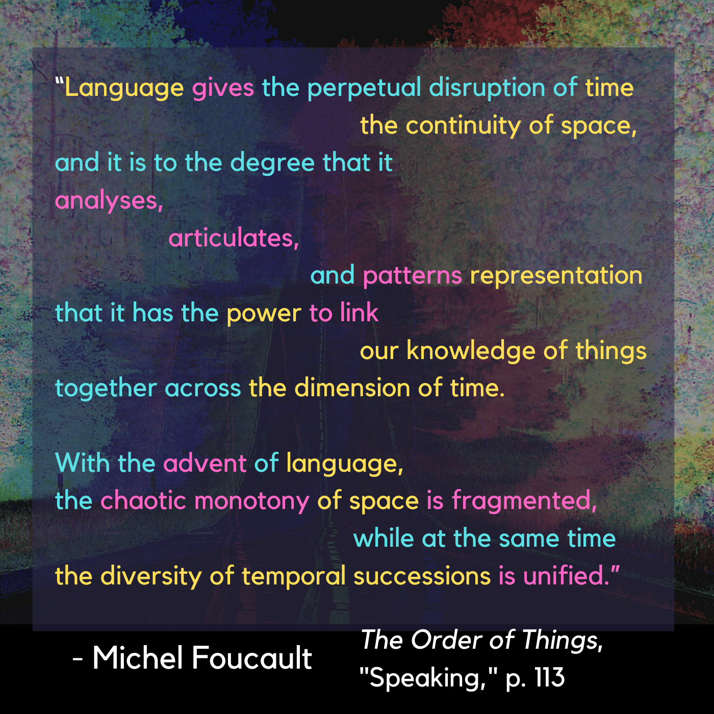
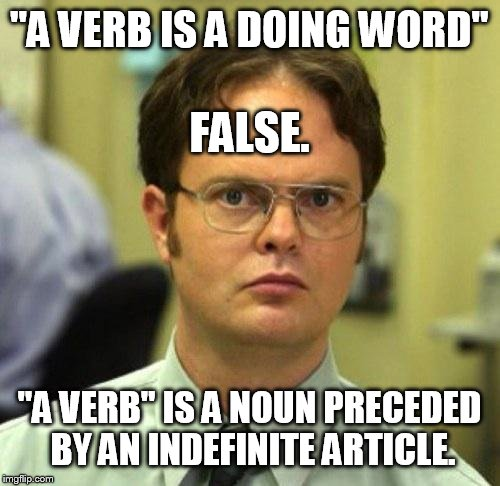
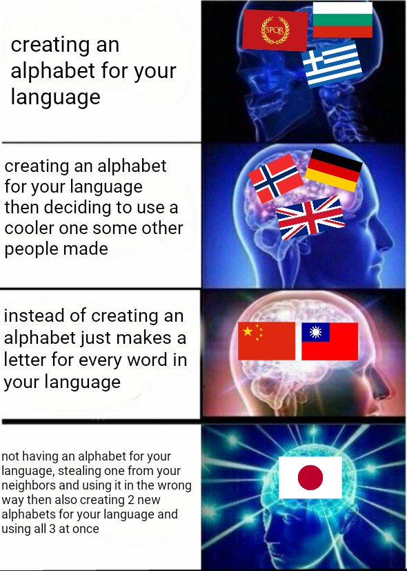

|:---------------------------------|:------------------------------------------------------|
| Foucault points out how the increasing formalization of ordering-structure within individual fields of study allowed for the entrance of the comparative, and the abstract universal, as layers of analysis: “*General grammar is the study of verbal order in its relation to the simultaneity that it is its task to represent*. Its proper object is therefore neither thought nor any individual language, but *discourse*, understood as a sequence of verbal signs.” (Foucault, 1970, p. 83) In other words, where we'd take for granted that "discourse" has always been in existence, humans have only been self-aware of it for a relatively short period of time. |  |
| This dimension of language, which rigorously structures the backbone *within* each given language but varies widely in its norms and conventions *between* languages, that starts to formalize into “science” terms the unwieldy and chaotic generative creativity of communication itself. The introduction of “general grammar” started to formalize the untamed nature of human language up till that point, granting the possibility of situating “histories” of language and introducing a reflective, temporal element into its study. |  |

 
