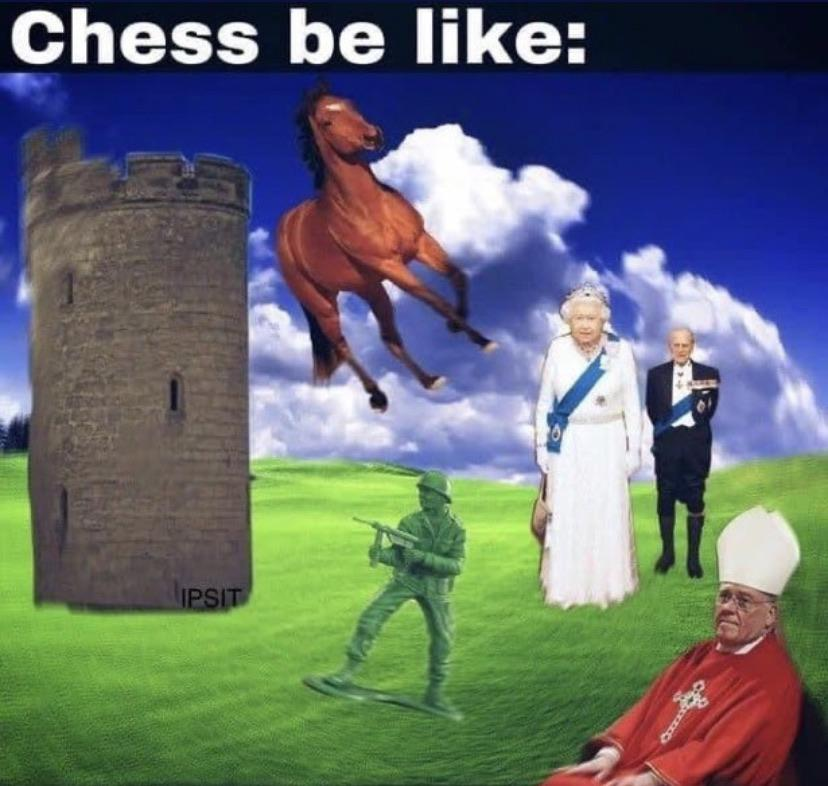

# Classifying 

| Words | Pictures |
|:---------------------------------|:------------------------------------------------------|
|In the Classical Age, attempts to establish     a sense of ordered classes of “character”     from the visible elements of the natural world     lead humans beyond just *drawing things together*     and well into the realm of *discriminating between things*     based on pre-existing frameworks.     **Rudimentary** frameworks at this stage, but still. |  |
| Foucault uses the incremental journey towards *biological taxonomy*     as one of many examples of this shift:     [Linnaeus](https://en.wikipedia.org/wiki/Systema_Naturae) introduced a system which was arbitrary and relative,     but became the skeleton to an increasingly universalized     and extensible framework for categorizing known life forms. |   |
| [Lamarck](http://knarf.english.upenn.edu/People/lamarck.html#:~:text=Lamarck%2C%20studying%20Linnaeus's%20system,largely%20the%20work%20of%20Lamarck) took this further, providing the transition point     where Darwin would later pivot into full modernist disruption. |  |

