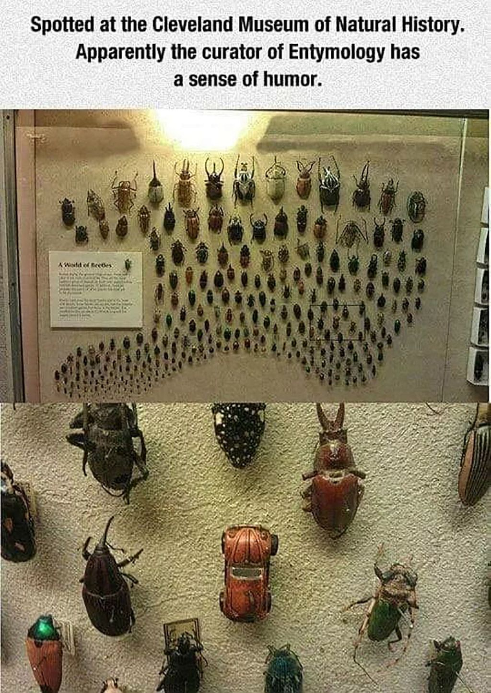
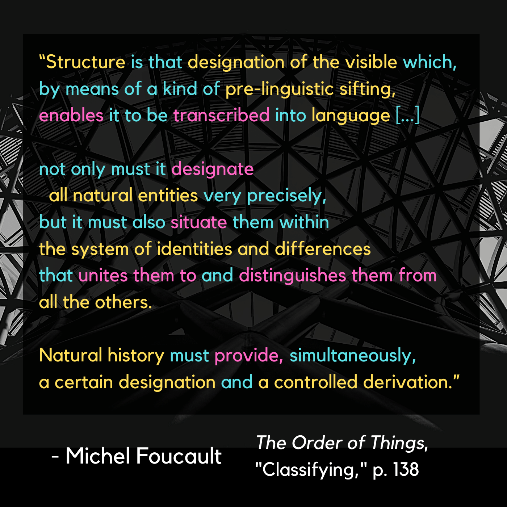

# Classifying 

|:---------------------------------|:------------------------------------------------------|
Attempts to establish a sense of ordered classes of “character” from the visible elements of the natural world lead humanity in the Classical Age to move beyond just "drawing things together" and well into the realm of "discriminating between things based on pre-existing frameworks." *Rudimentary* frameworks at this stage, but still.

Foucault gives the excellent illustration of the incremental journey towards biological taxonomy as indicative of this shift in order and knowledge:

|:---------------------------------|:------------------------------------------------------|
| [Linnaeus](https://en.wikipedia.org/wiki/Systema_Naturae) introduced a system which was arbitrary and relative, but became the skeleton to an increasingly universalized and extensible framework for categorizing known life forms. [Lamarck](http://knarf.english.upenn.edu/People/lamarck.html#:~:text=Lamarck%2C%20studying%20Linnaeus's%20system,largely%20the%20work%20of%20Lamarck) took this further and provided the transition point where Darwin would pivot into full modernist disruption |  |

