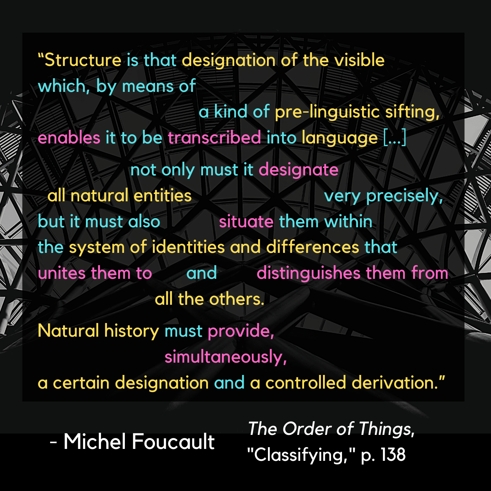

# Classifying 

|:---------------------------------|:------------------------------------------------------|
|Attempts to establish a sense of ordered classes of “character”   from the visible elements of the natural world   lead humans in the Classical Age beyond just *drawing things together*   and well into the realm of *discriminating between things based on pre-existing frameworks*.   *Rudimentary* frameworks at this stage, but still. |  |

### Foucault uses the incremental journey towards *biological taxonomy* as one of many examples of this shift:

|:---------------------------------|:------------------------------------------------------|
| [Linnaeus](https://en.wikipedia.org/wiki/Systema_Naturae) introduced a system which was arbitrary and relative,   but became the skeleton to an increasingly universalized   and extensible framework for categorizing known life forms. | [Lamarck](http://knarf.english.upenn.edu/People/lamarck.html#:~:text=Lamarck%2C%20studying%20Linnaeus's%20system,largely%20the%20work%20of%20Lamarck) took this further and provided the transition point   where Darwin would pivot into full modernist disruption. |

