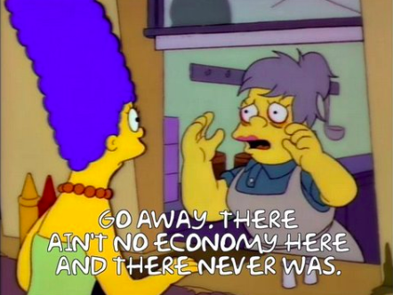
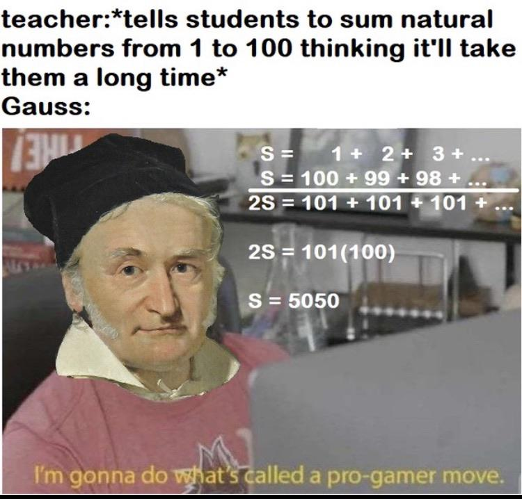
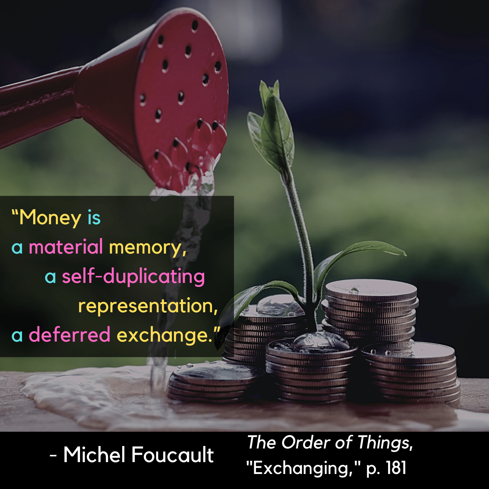

# Exchanging

| Words | Pictures |
|:---------------------------------|:------------------------------------------------------|
| In the Renaissance episteme, exchange was   a direct barter or trade transaction.   The things being exchanged   never strayed too far from their representative value. |  |
| The advent of the Classical Age resulted in   the same shifts for exchange as it did for language.     Representation and abstraction entered the picture,   which allowed for (even *demanded*) the construction   of universal order and rules for the field.     We used to compare trinkets,   now we estimate their production time. |  |
| The possibility of substitution enabled greater abstraction.     Rather than tending towards a simple central taxonomy,   this abstraction led to greater fracturing in categories of knowledge.     And in this process of gradual abstraction,   "...cheapness is neither more nor less exact than dearness”   (Foucault, 1970, p. 184) |  |

