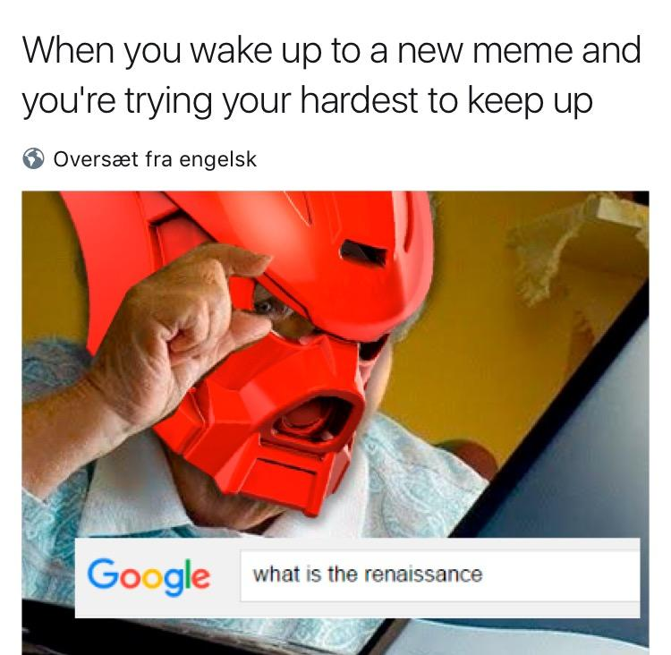
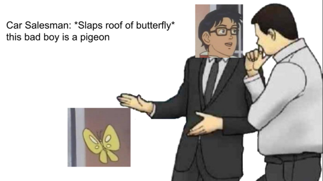

# The Limits of Representation

| Words | Pictures |
|:---------------------------------|:------------------------------------------------------|
| Here's where Foucault shifts gears   from topical deep-diving   to orient his larger archaeological investigation.     We return to a concept he first broached   in "The Prose of the World"   - **limits**. |  |
| In the Renaissance, he focused on   the structural limits of representation   for its subjects.     As we move through investigating   the shifts of the Classical Age,   and into the Modern,   we encounter a different type of limit:   the self-conscious limits of systems   which humans have co-created   to lend frames of order to the chaotic world,   and to better understand themselves. |  |
| For at last, we started to have   "selves" to understand!     Even if, along the way to fashioning our "selves"     we were doomed to see our own limits in them... |  |

