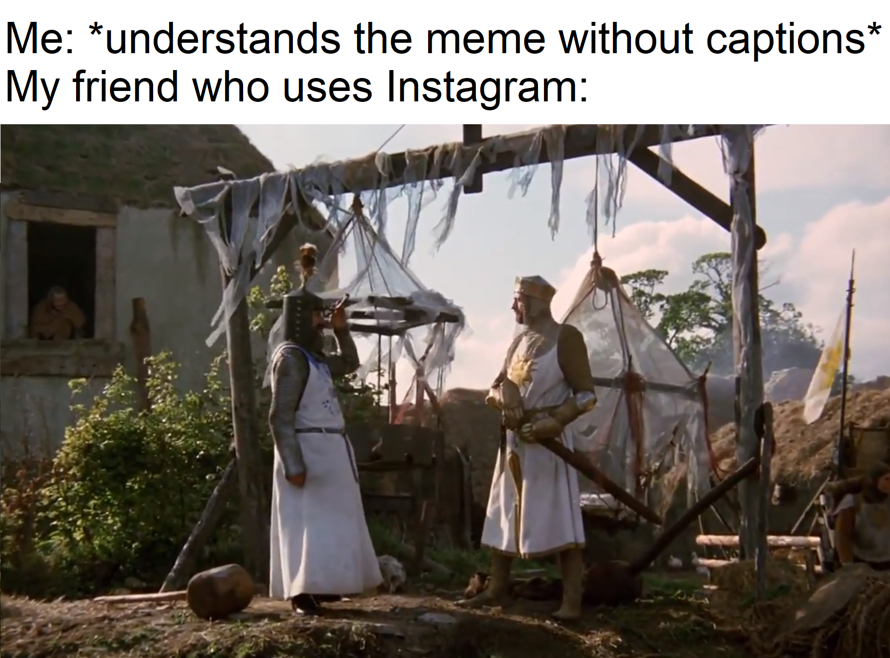

Here's where Foucault shifts gears from topical deep-dives to orient his larger archaeological investigation.

We return to a concept he first broached in "The Prose of the World" - limits. In the Renaissance, he was interested in the structural limits of representation for its subjects. As we move through investigating the shifts of the Classical Age, and into the Modern, we encounter a different type of limit- the self-conscious limits of systems which humans have begun to architect to lend frames of order to the chaotic world, and to better understand themselves.

