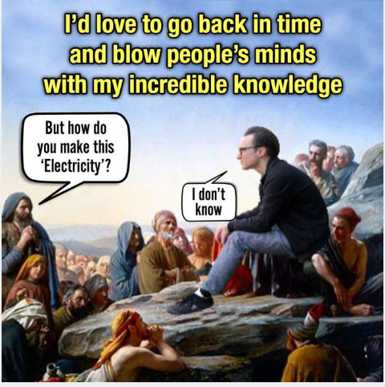
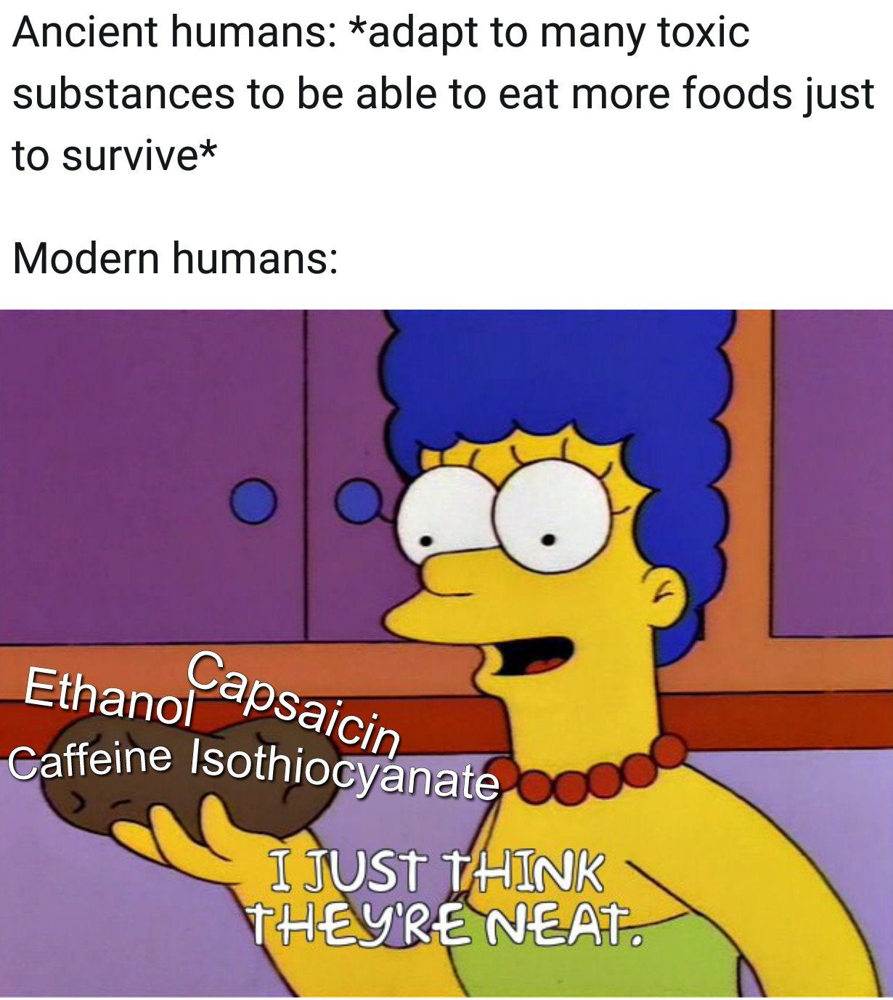
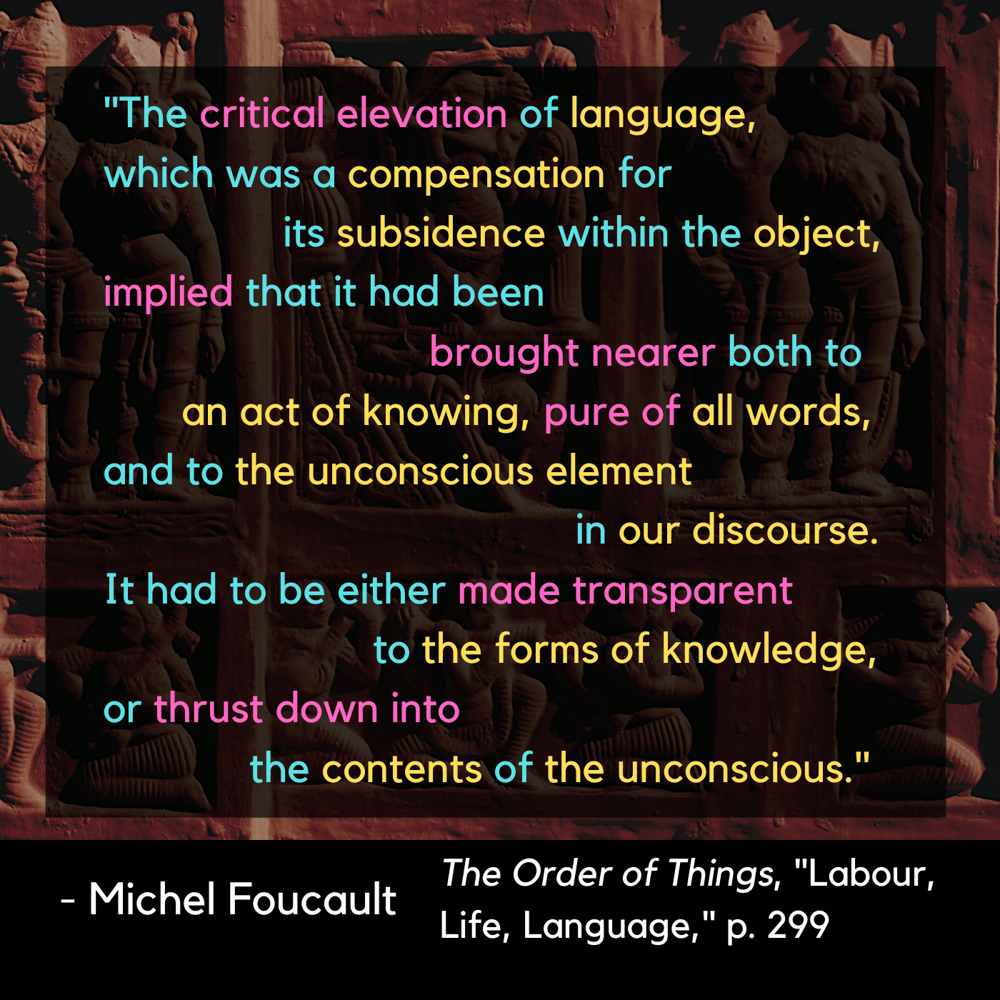

# Labour, Life, Language

| Words | Pictures |
|:---------------------------------|:------------------------------------------------------|
| The title of this chapter covers the broad realm where Foucault locates the focus of the empirical sciences. Here he returns to many of the topics he covered in-depth in the first half of the book, and positions them more explicitly in terms of the disruptive thinkers in each field which led us towards, in Foucault's eyes, the "creation of Man" and the birth of the Modern episteme. |  |
| |  |
| |  |

