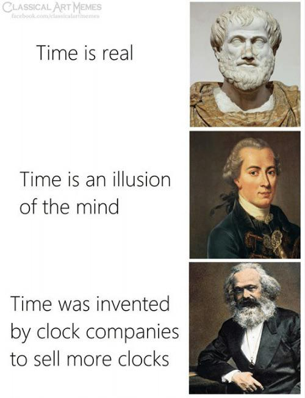

# Labour, Life, Language

| Words | Pictures |
|:---------------------------------|:------------------------------------------------------|
| "Labour," "Life," and "Language" cover the broad realm   where Foucault locates the focus   of the empirical sciences,   and he addresses many specific figures   who were pivotal to disrupting the Classical episteme. |  |
| Here he returns to many of the topics   he covered in-depth earlier in the book,   and positions them more explicitly   in terms of the "creation of Man"   and the birth of the Modern episteme.  |  |
| Here is where we begin to plumb the depths   of the unconscious mind, and make space   for purposeful and even generative juxtapositions. |  |

