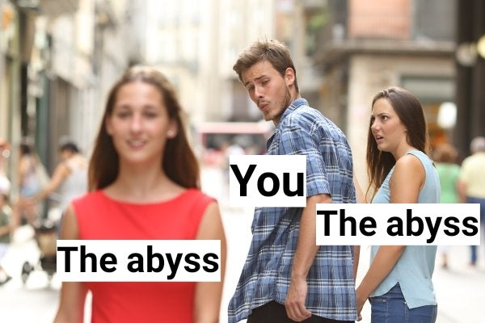
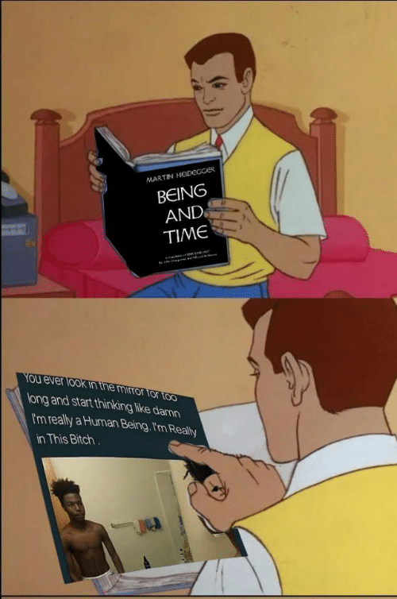
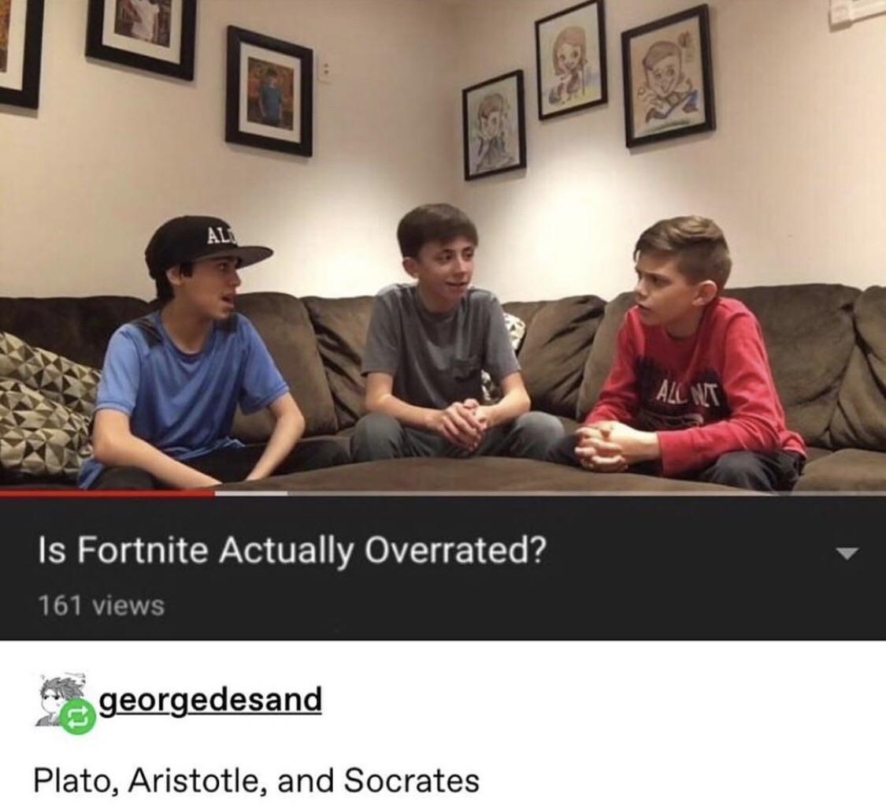

# Man and His Doubles

| Words | Pictures |
|:---------------------------------|:------------------------------------------------------|
| Here's where Foucault really gets into his element,   wading into both philosophy as a practice   and the broader philosophical implications   of all he's discussed to this point. |  |
| He points towards the cascading   inward spiral of reflexive thought,   the series of "doubles" created within human reflection   by making "Man" increasingly the object of human thought. |  |
| One can only wonder   what Foucault might have thought about   the viciously self-referential nihilistic trends   of modern meme culture. |  |

