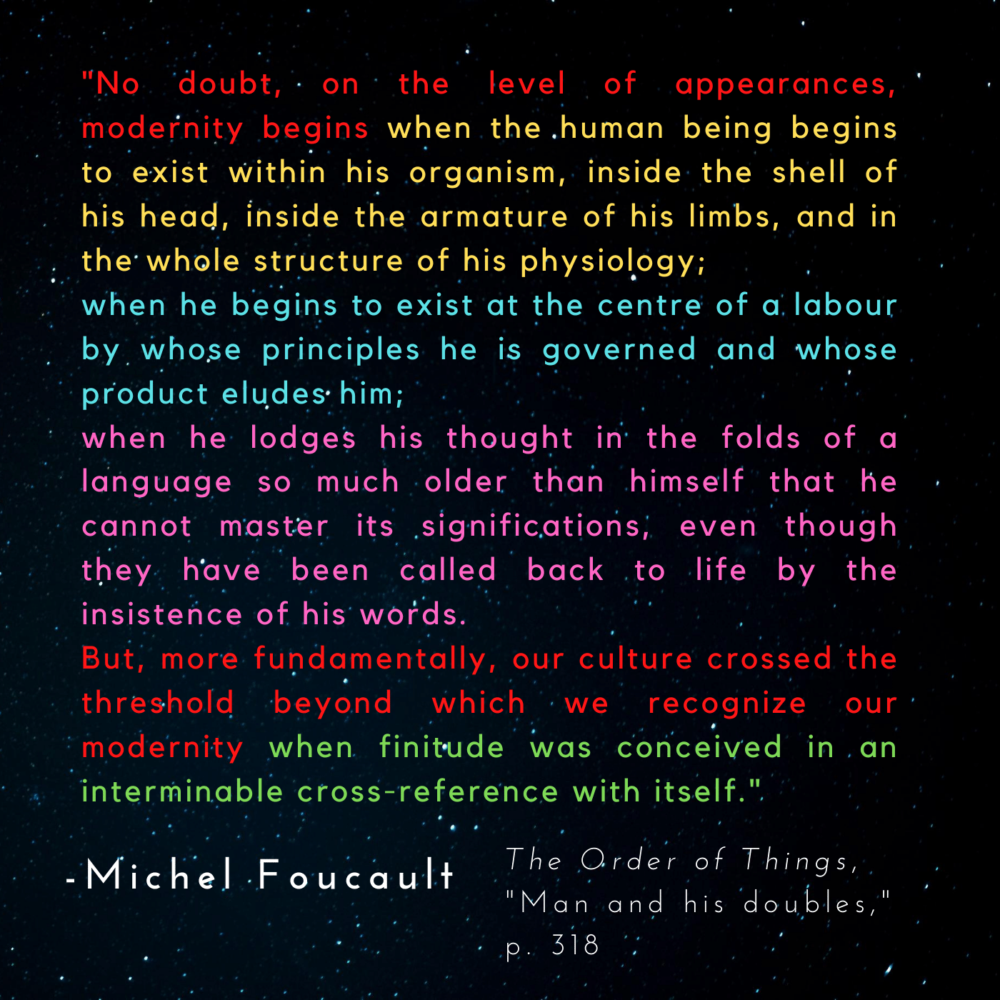

Here's where Foucault really gets into his element, wading into both philosophy as a practice and the philosophical implications of all he's discussed to this point.

He points towards the cascading inward spiral of reflexive thought, the series of "doubles" created within human reflection by making "Man" increasingly the object of human thought.
