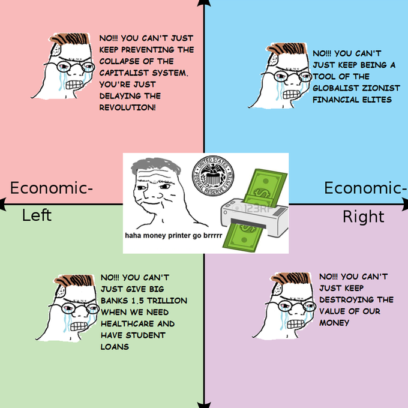
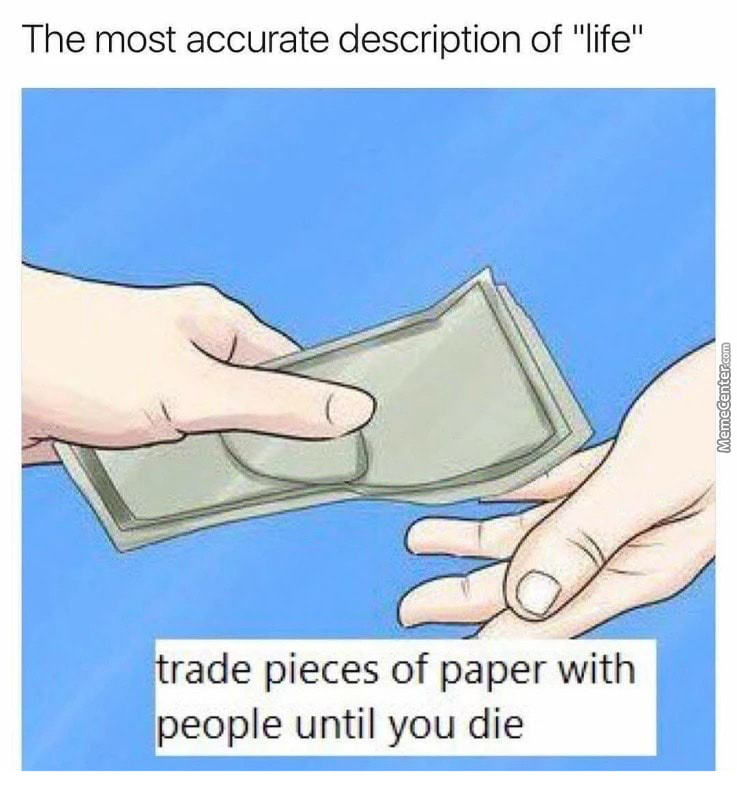

The analysis of prices outside of direct exchange was not an element of early Renaissance thought, 

“The two functions of money, as a common measure between commodities and as a substitute in the mechanism of exchange, are based upon its material reality. A measure is stable, recognized as valid by everyone and in all places, if it has as a standard an assignable reality that can be compared to the diversity of things that one wishes to measure” (Foucault, 1970, p. 169)

“For Classical thought in its formative phase, money is that which permits wealth to be represented. Without such signs, wealth would remain immobile, useless, and as it were silent [...] it is in its quality as a universal sign that it becomes a rare and unequally distributed commodity” (Foucault, 1970, p. 177)

“Money is a material memory, a self-duplicating representation, a deferred exchange” (Foucault, 1970, p. 181) plaster this emo quote up on a meme-style interface

“There can therefore be no fair price: nothing in any given commodity indicates by any intrinsic character the quantity of money that should be paid for it. Cheapness is neither more nor less exact than dearness” (Foucault, 1970, p. 184)

## Meme Options

